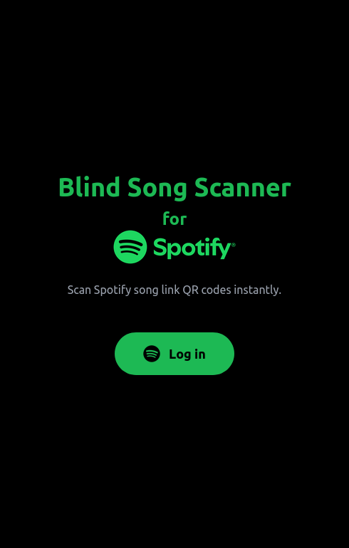
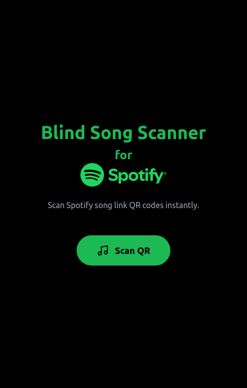
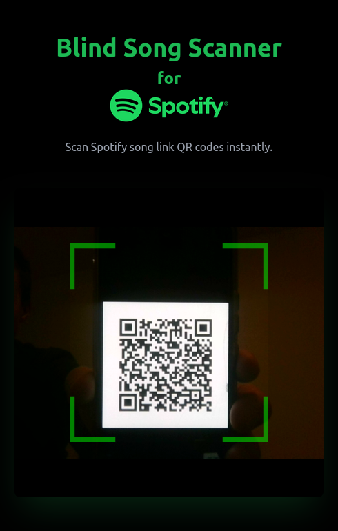
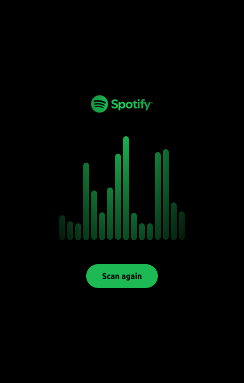
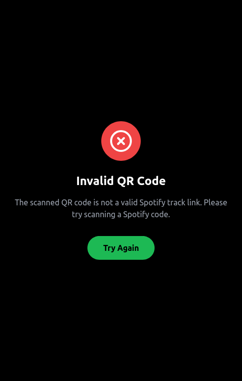

# Blind Song Scanner

QR code scanner for playing Spotify songs blindly.

Playing music is not yet implemented.

To install and start this React app in development:
```
npm install
npm run start
```

## Demo

An earlier version can be found here: https://classy-narwhal-f1da6f.netlify.app/

## Screenshots





