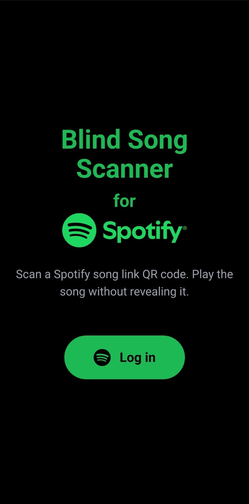
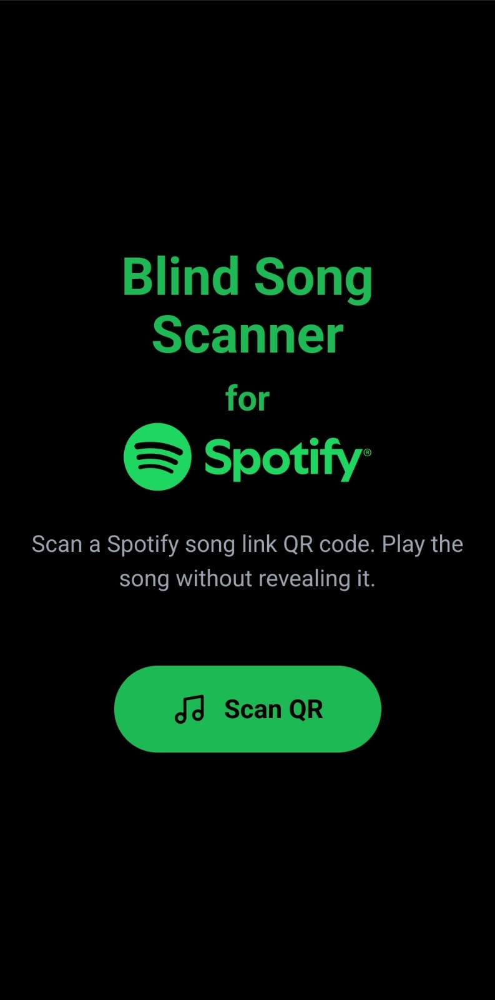
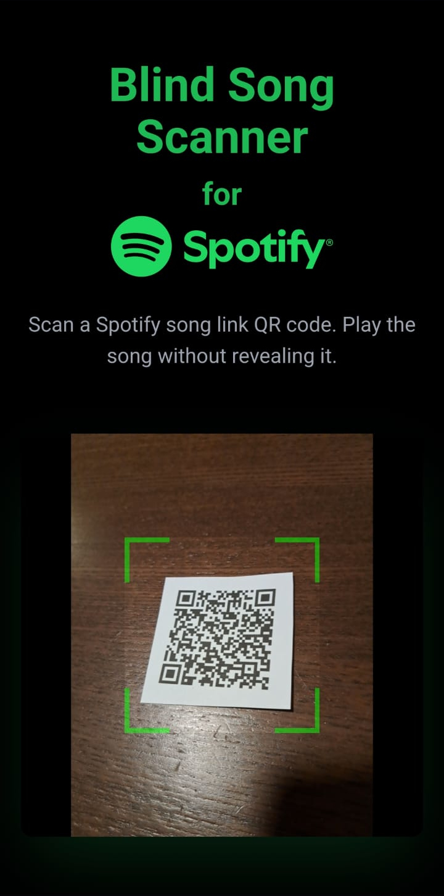
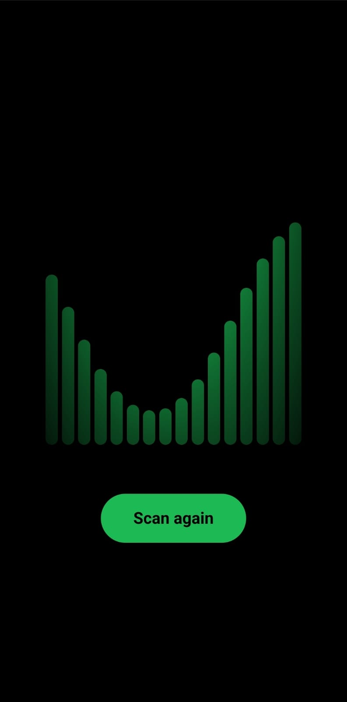
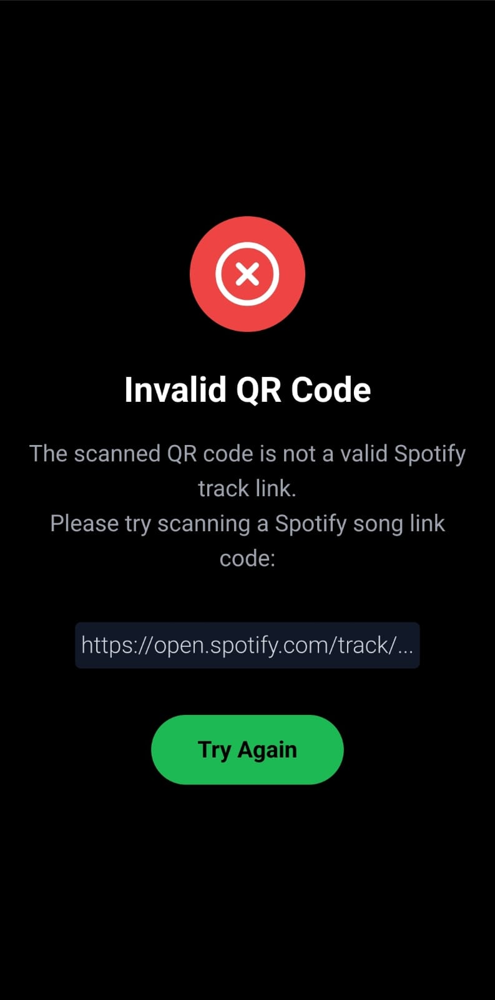

# Blind Song Scanner

> **Demo:** [blind-song-scanner.netlify.app](https://blind-song-scanner.netlify.app)

QR code scanner web application for playing Spotify songs blindly.
- Log in with a Spotify Premium account.
- Scan a QR code with a Spotify song URL (e.g. [https://open.spotify.com/track/...](https://open.spotify.com/track/4PTG3Z6ehGkBFwjybzWkR8?si=8c83c6d0e3f5404e)).
- The app immediately starts playing the song without revealing any details about it.

This app was designed to enable a range of musical party games. 
For example, physical tiles may be printed with a song's name, artist and/or publication year on the other side. 

-------

## Development

This application was built with npm/11.0.0 and vite/5.4.8. This project's code is in a work-in-progress state, it has several glitches and many opportunities for refactoring.

To install and start this React app locally, clone the repository and run:

```
npm install
npm run start
```

To get the Spotify log-in to work, create a client in the [Spotify for Developers dashboard](https://developer.spotify.com)
and fill in the Client ID in `app/data/config.ts`.

Make sure to apply linting after making changes:

```
npm run lint:fix
```

## Screenshots






